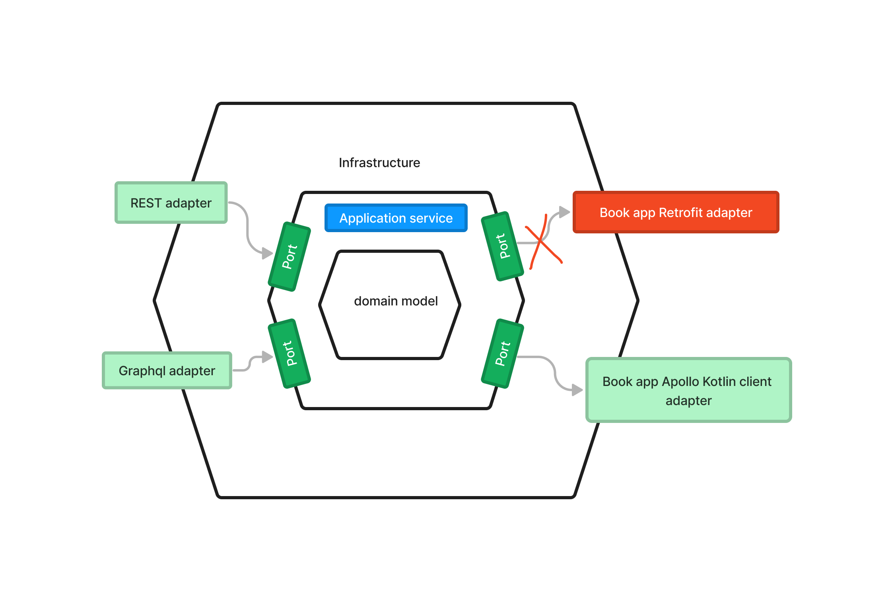

# BookLibrary

This is a book library service.

## Functionality

This service, exposes REST APIs for borrowing books. At the moment, only one hardcoded book
with ID "f0249d34-945c-4b8d-9e68-6bafb6fae7e0" can be borrowed. The complete CRUD functionality is coming soon.

## Project structure

The project is developed using **Hexagonal** architecture (see
e.g. [here](https://en.wikipedia.org/wiki/Hexagonal_architecture_(software))).



In such simple projects, one might consider using a **technically driven** layered architecture, instead of a
**domain driven** (Hexagonal) architecture. However, the Hexagonal structuring of the code here comes for no additional
costs (and with the typical Hexagonal architecture advantages). This is also because a simplified Hexagonal approach has
been
adopted. The packages are organized as follows:

```
└── fkh
    └── booklibrary
        ├── BookLibrary.kt
        ├── application
        │   └── service
        │       └── BorrowBookService.kt
        ├── infrastructure
        │   ├── Configs.kt
        │   └── adapters
        │       ├── input
        │       │   └── http
        │       │       └── BorrowBookController.kt
        │       └── output
        │           └── graphql
        │               ├── BookAppGraphqlClient.kt
        │               └── GraphqlCallNonSuccessfulError.kt
        └── model
            ├── BorrowBook.kt
            ├── DomainError.kt
            └── ports
                └── BookFinder.kt

```

An example where the benefit of Hexagonal becomes evident is the replacement of the Infrastructure technologies.
For example, here initially a Retrofit client was used to call the Book App service APIs (
see ```branch-http-client-retrofit``` branch).
However, later on this technology was replaced by Apollo Kotlin client (see Hexagonal Figure above).
This change only affected the Infrastructure layer by removing the old Retrofit codes and replacing them by the new
Apollo Kotlin client codes. Furthermore, no extra changes were needed in any other layers of the application, i.e.
domain, application, or any
other parts of the Infrastructure. Had we used a layered architecture, such changes would typically
involve many changes to all the technical layers.
